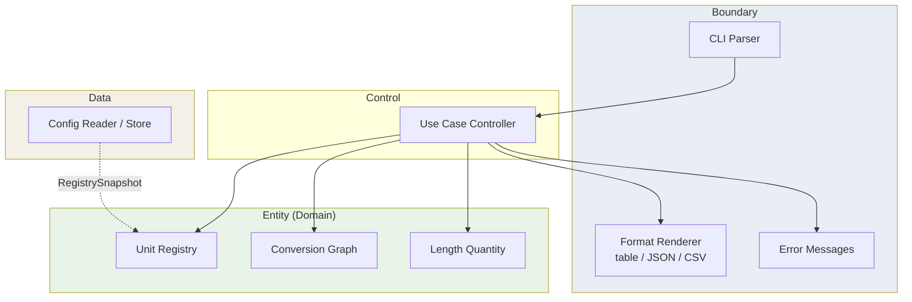

# UnitConverter (C++)

**meter 허브 기준 길이 단위 변환 CLI**와 **검증 가능한 계약·테스트 체계** — C++·클린 아키텍처(OCP/SRP, BCE)를 학습하는 개발자를 위해, 단위·비율·출력 변경 시에도 회귀 없이 구조를 확장하는 실습 프로젝트입니다.


**문서 상태**: v1.0 개발 중 — [To-Do](docs/TODO.md) Must-Have 미완료 시 [PRD](docs/PRD.md) §7.1 AC-01~03 미충족

---

## 목차

- [개요 (Overview)](#개요-overview)
- [RED 단계에서 해야 할 일](#red-단계에서-해야-할-일)
- [RED 단계 To-Do 리스트](#red-단계-to-do-리스트)
- [빠른 시작 (Quick Start)](#빠른-시작-quick-start)
- [지원 단위 및 비율](#지원-단위-및-비율)
- [입력 형식 계약](#입력-형식-계약)
- [아키텍처](#아키텍처)
- [테스트 실행](#테스트-실행)
- [설정 파일 (JSON/YAML)](#설정-파일-jsonyaml)
- [출력 포맷](#출력-포맷)
- [기여 가이드 (Contributing)](#기여-가이드-contributing)
- [관련 문서](#관련-문서)
- [라이선스](#라이선스)

---

## 개요 (Overview)

### 이 프로젝트가 해결하는 문제

초기 프로토타입은 **파싱·환산·출력이 한 파일의 `if/else`에 결합**되어 있습니다. 단위가 늘거나 비율이 바뀌거나 JSON/CSV 출력이 필요해질 때마다 같은 파일을 반복 수정하게 되고, **자동화된 계약 테스트가 없으면** “돌아가는 것 같음”만으로 변경을 승인하게 됩니다.

본 프로젝트는 상용 서비스가 아니라, **Domain(환산·등록) · Boundary(파싱·직렬화·에러) · Data(비율 로드) · Control(유스케이스)** 를 분리하고 Catch2로 불변식을 고정하는 **학습용 코드베이스**로 발전시키는 것을 목표로 합니다.

### 주요 학습 목표

| 목표 | 내용 |
|------|------|
| **OCP** | 신규 단위·출력 포맷 추가 시 변환 **핵심 알고리즘 diff 0** |
| **SRP** | Entity / Boundary / Data / Control 책임 분리 |
| **BCE** | Boundary → Control → Entity, Data → Entity 포트 (역방향 금지) |
| **Dual-Track TDD** | Domain RED→GREEN과 Boundary 계약 테스트(Mock) 병렬 진행 |

### PRD와의 연결

요구·인수·회귀 규칙의 **단일 정본**은 [docs/PRD.md](docs/PRD.md) v1.0 입니다. 작업 우선순위·마일스톤은 [docs/TODO.md](docs/TODO.md) 를 따릅니다. 레거시 실습 요구 초안은 [docs/requirment.md](docs/requirment.md) 에 있습니다.

---

## RED 단계에서 해야 할 일

RED 단계의 목표는 기능을 먼저 완성하는 것이 아니라, **README·PRD의 요구사항을 실패하는 테스트로 고정**하는 것입니다. 이 단계가 끝났을 때 테스트는 실패해야 하며, 실패 이유가 “아직 구현되지 않은 요구 계약”을 정확히 가리켜야 합니다.

### 1. README와 PRD 계약 정합성 확인

- `meter`, `feet`, `yard` 기본 단위와 비율을 하나의 의미로 고정합니다.
- `1 meter = 3.28084 feet`, `1 meter = 1.09361 yard` 기준으로 테스트 기대값을 작성합니다.
- 출력 표시값은 **HALF_UP 소수 4자리**, Domain 내부 비교는 **ε = 1e-9**로 분리합니다.
- README 예시, [docs/PRD.md](docs/PRD.md), [docs/TODO.md](docs/TODO.md)의 수치·에러 문구가 서로 다르면 RED 전에 먼저 정리합니다.

### 2. 테스트 실행 골격 만들기

아직 GREEN 구현을 시작하지 말고, 먼저 테스트가 실행될 수 있는 최소 구조를 만듭니다.

- `CMakeLists.txt` 추가
- 실행 타깃 `UnitConverter`와 테스트 타깃 분리
- Catch2 기반 테스트 디렉터리 추가
- `ctest --test-dir build --output-on-failure`로 실패 테스트를 볼 수 있게 구성

권장 테스트 파일:

```text
tests/
  domain_tests.cpp
  boundary_tests.cpp
  integration_tests.cpp
```

### 3. Domain 실패 테스트 작성

Domain 테스트는 콘솔 입출력 없이 순수 계산 규칙만 검증합니다.

- 기본 Registry에 `meter`, `feet`, `yard`가 등록되어야 함
- `1 meter`는 `3.28084 feet`, `1.09361 yard`로 환산되어야 함
- `feet`↔`yard` 환산은 직접 비율이 아니라 **meter 허브**를 경유해야 함
- `ConvertAll` 결과 개수는 Registry에 등록된 단위 수와 같아야 함
- `0`, 음수, NaN, Inf 값은 거부되어야 함
- 새 단위가 추가되어도 변환 핵심 알고리즘을 수정하지 않는 구조를 전제로 테스트를 작성함

예상 태그:

```text
[ratio] [domain] [registry] [quantity]
```

### 4. Boundary 실패 테스트 작성

Boundary 테스트는 파싱, 출력 포맷, 에러 문구처럼 외부 계약을 고정합니다.

- `meter:2.5` 파싱 성공
- `meter2.5` → `ERR-INPUT-001`
- `mile:1` → `ERR-INPUT-002`
- `meter:-1` → `ERR-INPUT-003`
- `meter:abc` → `ERR-INPUT-004`
- `1meter:2.5` 또는 빈 단위명 → `ERR-INPUT-005`
- 실패 시 stdout 변환 결과 0줄, stderr prefix 고정, exit 1
- 성공 시 stderr 비어 있음, exit 0

예상 태그:

```text
[parse] [boundary] [error-contract] [table]
```

### 5. 통합 실패 테스트 작성

통합 테스트는 사용자가 실제로 기대하는 CLI 동작을 고정합니다.

- 입력 `meter:2.5`
- exit code `0`
- stderr 비어 있음
- table 출력 3줄
- 기대 출력:

```text
2.5 meter = 2.5000 meter
2.5 meter = 8.2021 feet
2.5 meter = 2.7340 yard
```

실패 경로:

```text
meter2.5 -> Invalid format. Use unit:value (ex: meter:2.5), exit 1
mile:1   -> Unknown unit: mile, exit 1
```

### 6. RED 완료 기준

RED 단계는 아래 조건을 만족하면 완료입니다.

- README/PRD/TODO의 핵심 계약이 서로 충돌하지 않음
- CMake와 Catch2 테스트 실행 골격이 있음
- Domain, Boundary, Integration 테스트가 작성되어 있음
- 테스트 실행 결과가 **실패(RED)** 하며, 실패 이유가 미구현 기능 때문임
- 이 단계에서는 기존 [UnitConverter.cpp](UnitConverter.cpp)를 무리하게 고치지 않음

> RED의 산출물은 “동작하는 기능”이 아니라 “구현해야 할 계약을 정확히 설명하는 실패 테스트”입니다.

---

## RED 단계 To-Do 리스트

> 이 체크리스트는 test_plan.md 기반으로 생성되었습니다.
> 각 항목은 RED(실패 테스트 작성) 완료 시 체크합니다.
> 상세 보고서: [Report/RED_Todo_Checklist_Report.md](Report/RED_Todo_Checklist_Report.md) (RPT-RED-001)

### Track A — UI / Boundary 테스트
- [ ] TC-A-01: 정상 입력 "meter:2.5" → 변환 결과 반환 (Happy Path)
- [ ] TC-A-02: ":" 없는 입력 → std::invalid_argument 발생
- [ ] TC-A-03: 음수 입력 "meter:-1.0" → std::invalid_argument 발생
- [ ] TC-A-04: 없는 단위 "parsec:1.0" → std::invalid_argument 발생
- [ ] TC-A-05: 소수점 파싱 실패 "meter:abc" → std::invalid_argument 발생
- [ ] TC-A-06: 출력 포맷에 원 입력 단위·값 보존 ("2.5 meter = ...")
- [ ] TC-A-07: value=0 경계값 처리 확인

### Track B — Domain / Logic 테스트
- [ ] TC-B-01: convert("meter", 2.5, "feet") == 8.20210 (오차 1e-5)
- [ ] TC-B-02: convert("meter", 1.0, "yard") == 1.09361 (오차 1e-5)
- [ ] TC-B-03: convert("feet", 1.0, "meter") == 0.30480 (역변환)
- [ ] TC-B-04: convertAll("meter", 1.0) → 모든 등록 단위 변환 반환
- [ ] TC-B-05: registerUnit("cubit", 0.4572) 후 변환 가능
- [ ] TC-B-06: loadConfig(유효한 경로) → 비율 정상 로드
- [ ] TC-B-07: loadConfig(없는 경로) → 기본값(3.28084/1.09361) 유지

### 커버리지 목표
- [ ] Domain Logic: 95%+ (# gcov / lcov)
- [ ] Boundary Layer: 85%+
- [ ] 전체 TOTAL: 90%+

### 결함 목록 연결
- [ ] defect_list.md 생성 및 발견 결함 기록
- [ ] 모든 결함 수정 후 회귀 테스트 통과 확인

---

## 빠른 시작 (Quick Start)

### 사전 조건

| 항목 | 요구 |
|------|------|
| 컴파일러 | **C++17** 이상 (`g++`, `clang++`, MSVC 중 택 1) |
| 빌드 (목표) | **CMake** 3.16+ |
| 테스트 (목표) | **Catch2** v3 (CMake FetchContent 또는 패키지) |
| OS | Windows / Linux / macOS 콘솔 |

### 빌드 & 실행

#### 현재 베이스라인 (단일 파일 프로토타입)

CMake·Catch2 도입 전, 아래로 프로토타입을 실행할 수 있습니다.

```bash
g++ -std=c++17 -o UnitConverter UnitConverter.cpp
./UnitConverter
```

프롬프트 예: `Insert value for converting (ex: meter:2.5):`

#### 목표 빌드 (v1.0 — [TODO](docs/TODO.md) Must-Have)

```bash
cmake -S . -B build
cmake --build build
./build/UnitConverter
ctest --test-dir build --output-on-failure
```

> **학습자 통과 기준**: README 명령만으로 build·test·run 성공 ([PRD](docs/PRD.md) §2.2 시나리오 A).

### 예시 입출력 (`meter:5.0`)

**입력**

```text
meter:5.0
```

**출력 (table, PRD round4 — v1.0 목표 계약)**

```text
5.0 meter = 5.0 meter
5.0 meter = 16.4042 feet
5.0 meter = 5.4681 yard
```

| 항목 | 값 |
|------|-----|
| stderr | (비어 있음) |
| exit code | 0 |

> 표시값은 **HALF_UP 소수 4자리**입니다. Domain 내부 비교는 ε = **1e-9** ([PRD](docs/PRD.md) §3.2).

---

## 지원 단위 및 비율

모든 환산은 **meter 허브**를 거칩니다. feet↔yard **직접 비율 저장 금지**.

| 단위명 | 식별자 (`unit_token`) | meter 기준 비율 (1 unit = k meter) | 출처 |
|--------|----------------------|-----------------------------------|------|
| 미터 | `meter` | 1.0 | 기준 단위 |
| 피트 | `feet` | 3.28084 | [PRD](docs/PRD.md) §5.1 · Gherkin Background |
| 야드 | `yard` | 1.09361 | [PRD](docs/PRD.md) §5.1 · Gherkin Background |

**환산식 (Domain)**

- `value_in_meter = source_value × k(source)`
- `target_value = value_in_meter / k(target)`

---

## 입력 형식 계약

### 정상 입력 예시

| 입력 | 의미 |
|------|------|
| `meter:2.5` | 2.5 meter → 등록된 모든 단위로 환산 |
| `feet:3.28084` | 3.28084 feet → 전 단위 환산 |
| `yard:1.09361` | 1.09361 yard → 전 단위 환산 |

**문법**

- 형식: `{unit_token}:{value_token}` — 콜론 **정확히 1개**
- `unit_token`: `^[a-zA-Z][a-zA-Z0-9_]*$`, 길이 1~32 (trim 후)
- `value_token`: 유한 실수, **value > 0**

### 비정상 입력 예시

| 입력 | error_code | stderr 패턴 (prefix 고정) | exit |
|------|------------|---------------------------|------|
| `meter2.5` | ERR-INPUT-001 | `Invalid format. Use unit:value (ex: meter:2.5)` | 1 |
| `mile:1` | ERR-INPUT-002 | `Unknown unit: mile` | 1 |
| `meter:-1` | ERR-INPUT-003 | `Value must be positive: -1` | 1 |

**공통 실패 규칙**: stdout에 **변환 결과 줄 0개**, stderr에 위 prefix, exit **1**.

---

## 아키텍처

### BCE 레이어 (Mermaid)



### 의존성 방향

```text
Boundary  →  Control  →  Entity
                ↑
Data (포트 구현) ─┘→ Entity only

금지: Entity → Boundary, Entity → std::cout/파일 직접
```

| 레이어 | 책임 | 금지 |
|--------|------|------|
| **Entity** | Registry, ConvertAll, 등록 불변식, ε 검증 | I/O, 포맷 문자열 |
| **Control** | 파싱 결과→변환→렌더 순서, 모드 선택 | 비율 하드코딩 if/else |
| **Boundary** | 파싱, round4, ERR prefix, table/JSON/CSV | 환산 수식 |
| **Data** | JSON 스냅샷 로드·저장 | 환산 로직 |

### 새 단위 추가 방법 (코드 변경 최소화)

**목표 (OCP)**: 변환 알고리즘 핵심 파일 **0줄 수정**.

| 단계 | 담당 | 작업 |
|------|------|------|
| 1 | Data | `config/units.json`에 `"inch": 0.0254` 추가 (1 inch = 0.0254 meter) |
| 2 | Data | 앱 시작 시 스냅샷 로드 → Registry 반영 |
| 3 | Domain | (자동) ConvertAll 대상에 `inch` 포함 |
| 4 | Boundary | (자동) table/JSON/CSV 줄 수 +1 |
| 5 | 테스트 | ratio 테스트 1건 + ConvertAll 건수 N→N+1 갱신 ([PRD](docs/PRD.md) R-05) |

**런타임 등록 (v1.1, [F-09](docs/PRD.md))**

```text
register:cubit=0.4572 meter
```

이후 `cubit:1` 변환 가능. 중복 등록·ratio≤0 거부.

---

## 테스트 실행

### 테스트 프레임워크

**Catch2** — 태그 예: `[ratio]`, `[parse]`, `[json]`, `[csv]`, `[table]`, `[boundary]`

### 명령 (CMake 도입 후 목표)

```bash
cmake -S . -B build
cmake --build build
ctest --test-dir build --output-on-failure
```

태그 필터 예:

```bash
./build/unit_converter_tests "[ratio]"
./build/unit_converter_tests "[parse]"
```

커버리지 (gcov/llvm-cov 등 툴 선택):

```bash
cmake -S . -B build -DCMAKE_BUILD_TYPE=Debug -DENABLE_COVERAGE=ON
cmake --build build
ctest --test-dir build
# 툴별 리포트 생성 후 PRD 임계값 대조
```

### 커버리지 목표 ([PRD](docs/PRD.md) §4.3)

| 레이어 | Line | Branch | 추가 조건 |
|--------|------|--------|-----------|
| Domain | ≥ 95% | ≥ 90% | 실패 코드 8종 각 ≥1 테스트 |
| Boundary | ≥ 85% | ≥ 80% | ERR-INPUT-001~005 prefix 테스트 |
| Data | ≥ 90% | ≥ 85% | 로드 성공·실패 fixture |
| Control | ≥ 80% | ≥ 75% | US-01~06 각 1 통합 경로 |
| **전체** | ≥ 85% | — | Domain 미달 시 **v1.0 인수 불가** |

### v1.0 필수 GREEN 세트 ([PRD](docs/PRD.md) R-01)

- Domain: T-D-01 ~ T-D-06 (ratio·ConvertAll)
- Boundary: T-B-05 ~ T-B-07 (table/json/csv)
- 통합: T-I-01 + Gherkin 3 시나리오

---

## 설정 파일 (JSON/YAML)

### 위치 및 형식 (목표)

| 항목 | 값 |
|------|-----|
| 권장 경로 | `config/units.json` |
| YAML | v2.0 후보 ([TODO](docs/TODO.md) Nice-to-Have) |

**`config/units.json` 예시**

```json
{
  "base_unit": "meter",
  "units": {
    "meter": 1.0,
    "feet": 3.28084,
    "yard": 1.09361
  }
}
```

| 필드 | 규칙 |
|------|------|
| `base_unit` | 반드시 `"meter"` |
| `units[id]` | 1 id = k meter, **k > 0**, finite |

**로드 실패 시**: ERR-DATA-001/002, exit 1, 변환 미실행.

### 동적 단위 등록 ([PRD](docs/PRD.md) §5.3)

```text
register:cubit=0.4572 meter
```

| 항목 | 계약 |
|------|------|
| 의미 | 1 `cubit` = 0.4572 meter |
| 사후 | `cubit:1` → meter 표시 **0.4572** (ε), ConvertAll에 `cubit` 포함 |
| 금지 | 동일 `unit_token` 중복, ratio ≤ 0 |

---

## 출력 포맷

동일 입력·동일 Registry에서 **(target_unit, round4(value)) 집합**이 세 포맷에서 일치해야 합니다 ([PRD](docs/PRD.md) §6.4).

### 콘솔 (table) — 기본

**입력**: `meter:2.5`

```text
2.5 meter = 2.5 meter
2.5 meter = 8.2021 feet
2.5 meter = 2.7340 yard
```

- 패턴: `{source_value} {source_unit} = {target_value} {target_unit}`
- `target_value`: HALF_UP **4자리**

### JSON (v1.1 권장)

```json
{
  "format_version": "1",
  "source": { "unit": "meter", "value": 2.5 },
  "conversions": [
    { "unit": "meter", "value": 2.5 },
    { "unit": "feet", "value": 8.2021 },
    { "unit": "yard", "value": 2.7340 }
  ]
}
```

### CSV (v1.1 권장)

```csv
source_unit,source_value,target_unit,target_value
meter,2.5,meter,2.5
meter,2.5,feet,8.2021
meter,2.5,yard,2.7340
```

---

## 기여 가이드 (Contributing)

### 계약 변경 금지 원칙

| 규칙 | 내용 |
|------|------|
| **R-01** | 필수 테스트 세트 전부 GREEN 없이 merge 금지 |
| **R-02** | 비율·Gherkin 수치 변경 시 `units.json` + Domain 테스트 + PRD §5.1 **동일 PR** |
| **R-03** | ERR-* stderr **prefix** 변경 시 스냅샷 테스트만 의도적으로 갱신, 리뷰 2인 |
| **R-04** | Entity에서 stdout/파일 직접 사용 금지 |
| **R-05** | 신규 `unit_token` 추가 시 ConvertAll 기대 건수 **+1** 테스트 필수 |

### 테스트 없는 PR 거부 정책

- 동작 변경 PR → **Catch2 테스트 추가 또는 기존 테스트 갱신** 필수
- 리팩터 PR → 기존 R-01 필수 세트 **diff 0 (전부 GREEN)**
- 포맷만 추가 → Domain 테스트 변경 **0건** ([AC-04](docs/PRD.md))

### 커밋 메시지 컨벤션

```text
<type>(<scope>): <subject>

<body optional>
```

| type | 용도 |
|------|------|
| `feat` | F-01~F-10 기능 (scope: domain, boundary, data, control) |
| `test` | Catch2 추가·RED→GREEN |
| `docs` | README, PRD, TODO |
| `refactor` | 동작 동일 구조 변경 (R-01 필수) |
| `fix` | 계약 위반 수정 |

**subject**: 명령형, 50자 이내. 예: `feat(domain): add ConvertAll for registry units`

### PR 체크리스트 (요약)

- [ ] [docs/TODO.md](docs/TODO.md) 해당 항목 완료 기준 충족
- [ ] [PRD](docs/PRD.md) §7.1 AC 해당 항목 GREEN
- [ ] [PRD](docs/PRD.md) §7.2 회귀 #1~#10 (v1.0) 확인
- [ ] README 예시 입출력이 round4와 일치

---

## 관련 문서

| 문서 | 설명 |
|------|------|
| [docs/PRD.md](docs/PRD.md) | 요구·계약·인수·회귀 정본 |
| [docs/TODO.md](docs/TODO.md) | Must/Should/Nice, 마일스톤, 회귀 체크 |
| [docs/requirment.md](docs/requirment.md) | 초기 실습 요구 (레거시) |

---

## 라이선스

**MIT License** — 학습·실습·포크 자유. 상용 재배포 시에도 MIT 조건(저작권·면책 고지)을 유지하세요.

```text
MIT License

Copyright (c) 2026 UnitConverter contributors

Permission is hereby granted, free of charge, to any person obtaining a copy
of this software and associated documentation files (the "Software"), to deal
in the Software without restriction, including without limitation the rights
to use, copy, modify, merge, publish, distribute, sublicense, and/or sell
copies of the Software, and to permit persons to whom the Software is
furnished to do so, subject to the following conditions:

The above copyright notice and this permission notice shall be included in all
copies or substantial portions of the Software.

THE SOFTWARE IS PROVIDED "AS IS", WITHOUT WARRANTY OF ANY KIND, EXPRESS OR
IMPLIED, INCLUDING BUT NOT LIMITED TO THE WARRANTIES OF MERCHANTABILITY,
FITNESS FOR A PARTICULAR PURPOSE AND NONINFRINGEMENT. IN NO EVENT SHALL THE
AUTHORS OR COPYRIGHT HOLDERS BE LIABLE FOR ANY CLAIM, DAMAGES OR OTHER
LIABILITY, WHETHER IN AN ACTION OF CONTRACT, TORT OR OTHERWISE, ARISING FROM,
OUT OF OR IN CONNECTION WITH THE SOFTWARE OR THE USE OR OTHER DEALINGS IN THE
SOFTWARE.
```
