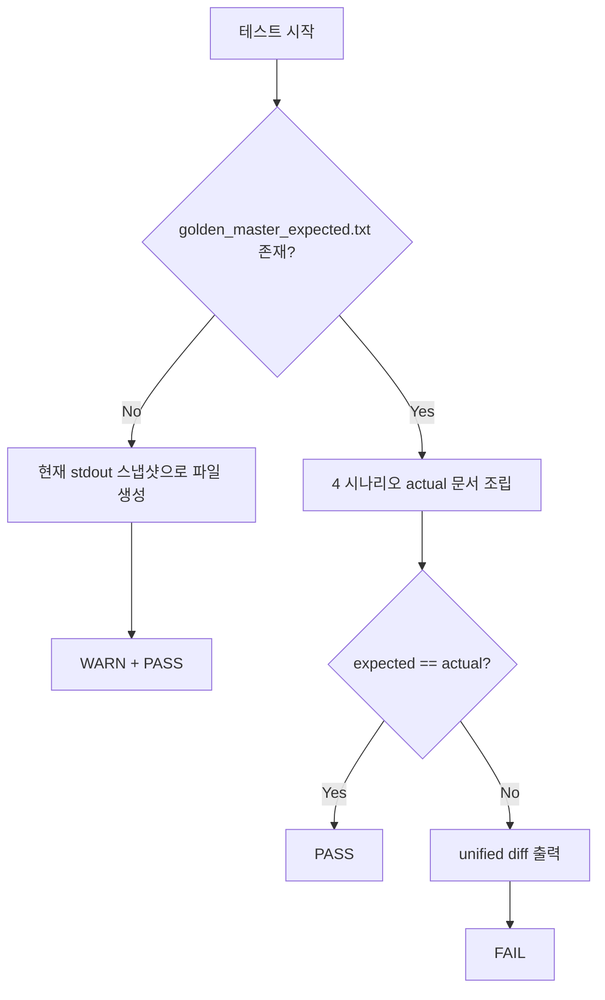

# Golden Master 회귀 테스트 보고서

## 문서 관리

| 항목 | 내용 |
|------|------|
| **보고서 ID** | RPT-GM-001 |
| **문서 유형** | Approval / Golden Master 회귀 테스트 설계·구현·실행 보고서 |
| **버전** | 1.0 |
| **작성일** | 2026-05-21 |
| **작성** | 회귀 테스트(Approval/Golden Master) 설계 |
| **프로젝트** | UnitConverter (C++17, CMake, Catch2 v3.5.4) |
| **정본 참조** | [../docs/PRD.md](../docs/PRD.md) §6.1·AC-02, [../docs/TODO.md](../docs/TODO.md) R-01, [05_GREEN_CATCH2_Test_Suite_Report.md](05_GREEN_CATCH2_Test_Suite_Report.md) (RPT-GREEN-001) |
| **선행 보고서** | [05_GREEN_CATCH2_Test_Suite_Report.md](05_GREEN_CATCH2_Test_Suite_Report.md) — GREEN 45건 PASS 전제 |
| **관련 산출물** | `tests/golden_master_expected.txt`, `tests/golden_master_tests.cpp`, `scripts/generate_golden_master.ps1`, `scripts/generate_golden_master.sh` |

---

## 요약 (Executive Summary)

`UnitConverter` 실행 파일의 **stdout 변환 테이블**을 Golden Master(기준 스냅샷)로 고정하고, Catch2에서 **approve 패턴**(기준 없으면 생성·있으면 문자열 비교)으로 회귀를 검증하는 체계를 도입하였다.

| 구분 | 내용 |
|------|------|
| **입력 시나리오** | 4건: `meter:2.5`, `feet:1.0`, `yard:1.0`, `meter:0.0` |
| **기준 파일** | `tests/golden_master_expected.txt` (Git 버전 관리 필수) |
| **회귀 테스트** | `Golden Master stdout regression` — 태그 `[golden][regression][r01]` |
| **GREEN 실행** | `ctest -R "Golden Master"` — **PASS** (약 3.2초) |
| **전체 스위트** | GREEN 빌드 기준 **46건 PASS** (기존 45 + Golden Master 1) |
| **RED 빌드** | `UNIT_CONVERTER_RED_PHASE=ON` 시 Golden Master 테스트 **SKIP** |

> **제안 커밋 메시지**: `test(regression): add Golden Master stdout approval for UnitConverter`

---

## 1. 목적·범위

### 1.1 목적

| 목적 | 설명 |
|------|------|
| **R-01 회귀** | `docs/TODO.md`·PRD의 pre-merge 회귀 세트에 CLI end-to-end 출력 검증 추가 |
| **Approval 테스트** | 도메인 단위 assertion 외에 **사용자 가시 출력**을 스냅샷으로 고정 |
| **의도적 변경 승인** | 출력 포맷·round4·ConvertAll 줄 수 변경 시 기준 파일을 **명시적으로 재생성** |

### 1.2 범위 (In / Out)

| In | Out |
|----|-----|
| `UnitConverter` stdout 변환 줄 (프롬프트 제외) | Domain·Boundary Catch2 단위 테스트 (기존 45건 유지) |
| 4개 고정 입력 시나리오 | JSON/CSV 출력 포맷 (v2 후보) |
| GREEN 빌드(`UNIT_CONVERTER_RED_PHASE=OFF`) | RED 스텁 빌드에서의 Golden Master 실행 |

---

## 2. 설계: Golden Master + Approve 패턴

### 2.1 캡처 방식

요구사항의 리디렉션 모델과 동일하게, 각 시나리오마다 **stdin 1줄 → stdout 캡처**한다.

```text
UnitConverter.exe < input.txt > actual.txt
```

Catch2 테스트(`golden_master_tests.cpp`)에서는 임시 디렉터리에 `input.txt`를 쓰고 `cmd /c` 리디렉션으로 `actual.txt`를 읽는다. 셸 스크립트(`generate_golden_master.ps1`)는 파이프 입력(`echo scenario | UnitConverter`)을 사용한다.

### 2.2 Approve 상태 전이



| 상태 | 동작 | 테스트 결과 |
|------|------|-------------|
| 기준 **없음** | `tests/golden_master_expected.txt` 자동 생성 | **PASS** + `WARN` (리뷰·`git add` 안내) |
| 기준 **있음**, 일치 | 문자열 전체 비교 (`\r\n` → `\n` 정규화) | **PASS** |
| 기준 **있음**, 불일치 | `--- expected` / `+++ actual` 줄 단위 diff | **FAIL** |

### 2.3 프롬프트·stderr 처리

| 채널 | 처리 |
|------|------|
| **stdout** | `Insert value for converting (ex: meter:2.5):` 프롬프트 접두어 제거. 첫 변환 줄이 프롬프트와 **같은 줄**에 붙는 경우 `): ` 마커 이후만 추출 |
| **stderr** | Golden Master 비교 대상 **제외** (`meter:0.0` 시 `ERR-INPUT-003`는 stderr만) |
| **exit code** | Golden Master 테스트에서 **검증하지 않음** (출력 스냅샷만 비교). `meter:0.0`은 stdout 변환 줄 0건 |

---

## 3. 입력 시나리오·기대 출력

### 3.1 시나리오 목록

| ID | 입력 | exit (참고) | stdout 변환 줄 | stderr (참고) |
|----|------|---------------|----------------|---------------|
| GM-01 | `meter:2.5` | 0 | 3줄 (feet·meter·yard) | (없음) |
| GM-02 | `feet:1.0` | 0 | 3줄 | (없음) |
| GM-03 | `yard:1.0` | 0 | 3줄 | (없음) |
| GM-04 | `meter:0.0` | 1 | **0줄** | `ERR-INPUT-003 Value must be positive: 0.0` |

### 3.2 기준 파일 구조

섹션 헤더 `[시나리오]`, 변환 줄, 구분자 `---` 로 문서화한다.

```text
[meter:2.5]
2.5000 meter = 8.2021 feet
2.5000 meter = 2.5000 meter
2.5000 meter = 2.7340 yard
---
[feet:1.0]
...
---
```

**정본 파일**: [../tests/golden_master_expected.txt](../tests/golden_master_expected.txt)

### 3.3 수치·포맷 정합 (PRD §6.1)

| 항목 | Golden Master 반영 |
|------|-------------------|
| round4 | `roundHalfUp4` + `setprecision(4)` → 예: `8.2021`, `2.7340` |
| ConvertAll | Registry 3단위 전부 출력 (자기 단위 줄 포함) |
| 입력 표기 | 파싱값 `2.5`도 출력 시 `2.5000` (고정 소수 4자리) |

초기 요구 예시(`2.5 meter = 8.202100 feet`)는 **6자리 예시**이며, 현재 구현·PRD AC-02는 **4자리 round4**가 정본이다.

### 3.4 GM-04 기준 스냅샷

```text
[meter:0.0]
---
```

변환 stdout이 없으므로 헤더 직후 `---` 만 존재한다. 이는 PRD BV-01(영값 거부·부분 출력 금지)과 일치한다.

---

## 4. 구현 산출물

### 4.1 파일 맵

| 경로 | 역할 |
|------|------|
| `tests/golden_master_expected.txt` | Git 추적 기준 스냅샷 |
| `tests/golden_master_tests.cpp` | Catch2 회귀·approve 로직 |
| `scripts/generate_golden_master.ps1` | Windows 기준 파일 재생성 |
| `scripts/generate_golden_master.sh` | Unix 기준 파일 재생성 |
| `CMakeLists.txt` | GREEN 시에만 golden 테스트·경로 매크로 추가 |

### 4.2 CMake 연동

`UNIT_CONVERTER_RED_PHASE=OFF` 일 때만:

- `tests/golden_master_tests.cpp` 를 `unit_converter_tests` 에 링크
- 컴파일 정의:
  - `UNIT_CONVERTER_EXE` → `$<TARGET_FILE:UnitConverter>`
  - `GOLDEN_MASTER_EXPECTED` → 소스 트리 `tests/golden_master_expected.txt`

### 4.3 Catch2 테스트 식별

| 항목 | 값 |
|------|-----|
| **TEST_CASE** | `Golden Master stdout regression` |
| **태그** | `[golden][regression][r01]` |
| **CTest 필터** | `ctest -R "Golden Master"` |

---

## 5. 기준 파일 생성·갱신 절차

### 5.1 사전 조건

```powershell
cmake -S . -B build -DUNIT_CONVERTER_RED_PHASE=OFF
cmake --build build
```

### 5.2 스크립트로 재생성 (권장)

```powershell
cd c:\DEV\UnitConverter_08
.\scripts\generate_golden_master.ps1
git add tests/golden_master_expected.txt
```

```bash
./scripts/generate_golden_master.sh build
git add tests/golden_master_expected.txt
```

### 5.3 수동 캡처 (참고)

시나리오별 `input.txt` 작성 후:

```powershell
.\build\UnitConverter.exe < input.txt > actual.txt
```

프롬프트 줄 제거 후 `golden_master_expected.txt` 섹션 형식으로 병합한다.

### 5.4 기준 변경 시 워크플로

1. 의도된 출력 변경을 코드에 반영
2. `generate_golden_master.ps1` 실행
3. diff 리뷰 후 `git add tests/golden_master_expected.txt`
4. `ctest -R "Golden Master"` 로 PASS 확인

---

## 6. 실행 결과

### 6.1 Golden Master 단독

```powershell
cd c:\DEV\UnitConverter_08\build
ctest -R "Golden Master" --output-on-failure
```

| 지표 | 결과 (2026-05-21) |
|------|-------------------|
| 테스트 | 1건 |
| 결과 | **PASS** |
| 실행 시간 | 약 3.2초 |

### 6.2 GREEN 전체 스위트

| 지표 | RPT-GREEN-001 (이전) | 본 회귀 추가 후 |
|------|----------------------|-----------------|
| Catch2 건수 | 45 | **46** |
| PASS | 45 | **46** |
| FAIL | 0 | 0 |

### 6.3 RED 빌드

`UNIT_CONVERTER_RED_PHASE=ON` 시 Golden Master 테스트는 컴파일·링크되지 않으며, RED 45건 동작은 기존과 동일하다.

---

## 7. 추적성 (Traceability)

| 요구 출처 | Golden Master 대응 |
|-----------|-------------------|
| PRD AC-02 / GH-01 | GM-01: `meter:2.5` 3줄·`8.2021 feet`·`2.7340 yard` |
| PRD §6.1 table + round4 | 전 시나리오 4자리 고정 출력 |
| PRD BV-01 / ERR-INPUT-003 | GM-04: stdout 0줄·stderr prefix (stderr는 스냅샷 외) |
| `docs/TODO.md` R-01 | `[r01]` 태그·pre-merge `ctest -R "Golden Master"` |
| RPT-GREEN-001 | GREEN 빌드 전제·Domain 45건과 **상호 보완** (단위 vs E2E stdout) |

---

## 8. 제한·향후

| 제한 | 설명 |
|------|------|
| 플랫폼 | `cmd /c` 리디렉션 (Windows 테스트 구현). Unix는 Catch2 내 동일 패턴·sh 스크립트 병행 |
| stderr / exit | Golden Master는 **stdout 변환 줄만** 비교. 통합 실패 시나리오는 별도 Catch2·Gherkin 테스트 유지 |
| 포맷 확장 | JSON/CSV Golden Master는 F-07 Should-Have 범위 |

| 향후 (Nice-to-Have) | |
|---------------------|---|
| `APPROVE=1` 환경 변수로 CI 없이 기준 덮어쓰기 | |
| stderr·exit code를 별도 `.expected.err` 스냅샷으로 분리 | |

---

## 9. 결론

- **4개 고정 입력**에 대한 `UnitConverter` stdout을 `tests/golden_master_expected.txt` 로 버전 관리한다.
- Catch2 **approve 패턴**으로 기준 부재 시 자동 생성, 불일치 시 diff 후 FAIL 한다.
- GREEN 빌드에서 **46/46 PASS** 를 확인하였으며, R-01 회귀 세트에 CLI 출력 스냅샷 검증이 추가되었다.

---

## 부록 A — 전체 기준 파일 내용

```text
[meter:2.5]
2.5000 meter = 8.2021 feet
2.5000 meter = 2.5000 meter
2.5000 meter = 2.7340 yard
---
[feet:1.0]
1.0000 feet = 1.0000 feet
1.0000 feet = 0.3048 meter
1.0000 feet = 0.3333 yard
---
[yard:1.0]
1.0000 yard = 3.0000 feet
1.0000 yard = 0.9144 meter
1.0000 yard = 1.0000 yard
---
[meter:0.0]
---
```

## 부록 B — 생성 스크립트 요약 (`generate_golden_master.ps1`)

| 단계 | 동작 |
|------|------|
| 1 | `build/UnitConverter.exe` 존재 확인 |
| 2 | 4 시나리오 순회, stdin 파이프 실행 |
| 3 | 프롬프트·`ERR-*` 줄 제거, `): ` 이후 변환 줄 추출 |
| 4 | `[scenario]` + 줄 + `---` 로 `tests/golden_master_expected.txt` 기록 (UTF-8 no BOM) |
| 5 | `git add tests/golden_master_expected.txt` 안내 출력 |
