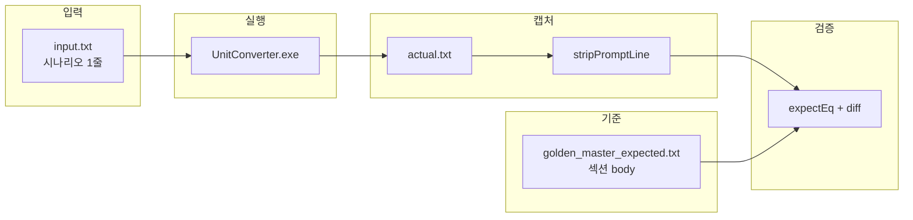

# Golden Master 회귀 테스트 구현 보고서

## 문서 관리

| 항목 | 내용 |
|------|------|
| **보고서 ID** | RPT-GM-002 |
| **문서 유형** | Approval / Golden Master 회귀 테스트 구현·산출물·실행 보고서 |
| **버전** | 1.0 |
| **작성일** | 2026-05-21 |
| **작성** | 회귀 테스트(Approval/Golden Master) 설계·구현 |
| **프로젝트** | UnitConverter (C++17, CMake, Catch2 v3.5.4) |
| **정본 참조** | [../docs/PRD.md](../docs/PRD.md) §6.1·AC-02, [../docs/TODO.md](../docs/TODO.md) R-01 |
| **선행 보고서** | [05_GREEN_CATCH2_Test_Suite_Report.md](05_GREEN_CATCH2_Test_Suite_Report.md) (RPT-GREEN-001), [06_REFACTORING_Golden_Master_Regression_Report.md](06_REFACTORING_Golden_Master_Regression_Report.md) (RPT-GM-001) |
| **관련 산출물** | `tests/test_golden_master.cpp`, `tests/golden_master_expected.txt`, `scripts/generate_golden_master.ps1`, `scripts/generate_golden_master.sh` |

---

## 요약 (Executive Summary)

`UnitConverter` CLI의 **stdout 변환 출력**을 Golden Master(기준 스냅샷)로 고정하고, Catch2 **4개 시나리오 테스트**로 회귀를 검증하는 구현을 완료하였다.

| 구분 | 내용 |
|------|------|
| **테스트 소스** | `tests/test_golden_master.cpp` |
| **기준 파일** | `tests/golden_master_expected.txt` (Git 버전 관리) |
| **시나리오** | GM-TC-01~04 (`meter:2.5`, `feet:1.0`, `yard:1.0`, `meter:0.0`) |
| **CTest 집계** | `ctest --test-dir build -R GoldenMaster` — **PASS** (~3.5초) |
| **Catch2** | GREEN **49/49 PASS** (단위 45 + Golden Master 4) |
| **RED 빌드** | `UNIT_CONVERTER_RED_PHASE=ON` 시 Golden Master **미컴파일** |

> **제안 커밋 메시지**: `test(regression): add Golden Master per-scenario stdout tests (GM-TC-01~04)`

---

## 1. 배경·목적

### 1.1 배경

| 항목 | 설명 |
|------|------|
| **GREEN 완료** | RPT-GREEN-001 — Domain·Boundary·Data Catch2 45건 PASS |
| **회귀 공백** | 단위 테스트는 `Converter::convert()` 수준; **CLI stdout E2E**는 미검증 |
| **R-01** | `docs/TODO.md` pre-merge 회귀에 CLI 출력 스냅샷 필요 |

### 1.2 목적

| 목적 | Golden Master 대응 |
|------|-------------------|
| **출력 고정** | 4자리 round4·ConvertAll 3줄 포맷을 스냅샷으로 잠금 |
| **리팩터 안전망** | `UnitConverter.cpp`·포맷 변경 시 diff로 회귀 즉시 탐지 |
| **시나리오 격리** | GM-TC별 독립 FAIL — 원인 입력 즉시 식별 |

---

## 2. 요구사항 충족 (P / C / T / F)

### 2.1 구현 요건 (P)

| # | 요구 | 구현 위치 |
|---|------|-----------|
| 1 | stdout 리디렉션 `UnitConverter < input.txt > actual.txt` | `captureStdoutForScenario()` — `cmd /c` + `generic_string()` 경로 |
| 2 | `std::ifstream` 파일 읽기·문자열 비교 (`EXPECT_EQ` 동등) | `readFile()`, `expectEq()` |
| 3 | `TEST_F(GoldenMasterTest, UnitConverter_*)` | Catch2 `TEST_CASE_METHOD` 4건 |
| 4 | `add_test(NAME GoldenMaster …)` | `CMakeLists.txt` L75–79 |
| 5 | (선택) ApprovalTests.cpp | **미적용** — Catch2 + 텍스트 기준으로 충분 |

### 2.2 기술 스택 (C)

C++17 · CMake 3.16+ · Catch2 v3.5.4 · `unit_converter_tests` 실행 파일

### 2.3 테스트 케이스 (T)

| ID | 입력 | TEST_CASE_METHOD 이름 | 기준 섹션 |
|----|------|----------------------|-----------|
| **GM-TC-01** | `meter:2.5` | `UnitConverter_meter_2_5` | `[meter:2.5]` |
| **GM-TC-02** | `feet:1.0` | `UnitConverter_feet_1_0` | `[feet:1.0]` |
| **GM-TC-03** | `yard:1.0` | `UnitConverter_yard_1_0` | `[yard:1.0]` |
| **GM-TC-04** | `meter:0.0` | `UnitConverter_meter_0_0` | `[meter:0.0]` (stdout 0줄) |

공통 태그: `[golden][regression][r01]`

### 2.4 산출물 (F)

| 산출물 | 경로 | 상태 |
|--------|------|------|
| Golden Master 테스트 | `tests/test_golden_master.cpp` | 완료 |
| 기준 스냅샷 | `tests/golden_master_expected.txt` | 완료 |
| CMake CTest | `add_test(NAME GoldenMaster …)` | 완료 |
| 실행 결과 | `ctest -R GoldenMaster` **PASS** | 확인 (§6) |

---

## 3. 아키텍처

### 3.1 데이터 흐름



### 3.2 비교 규칙

| 단계 | 함수 | 설명 |
|------|------|------|
| 1 | `extractSectionBody()` | `[scenario]` ~ `---` 사이 본문만 추출 |
| 2 | `captureStdoutForScenario()` | 리디렉션 후 프롬프트 제거 |
| 3 | `normalizeNewlines()` | `\r\n` / `\r` → `\n` |
| 4 | `trimTrailingNewlines()` | 끝 개행 1바이트 차이 흡수 |
| 5 | `expectEq()` | 불일치 시 `--- expected` / `+++ actual` diff |

### 3.3 제외 채널

| 채널 | Golden Master 처리 |
|------|-------------------|
| **stderr** | `2>nul` — 비교 제외 (GM-TC-04 `ERR-INPUT-003`) |
| **exit code** | 검증하지 않음 |
| **프롬프트** | `Insert value for converting …): ` 이후만 추출 |

---

## 4. 산출물 상세

### 4.1 `tests/test_golden_master.cpp`

```cpp
class GoldenMasterTest { /* UNIT_CONVERTER_EXE, GOLDEN_MASTER_EXPECTED */ };

TEST_CASE_METHOD(GoldenMasterTest, "UnitConverter_meter_2_5", "[golden][regression][r01]");
TEST_CASE_METHOD(GoldenMasterTest, "UnitConverter_feet_1_0",  "[golden][regression][r01]");
TEST_CASE_METHOD(GoldenMasterTest, "UnitConverter_yard_1_0",  "[golden][regression][r01]");
TEST_CASE_METHOD(GoldenMasterTest, "UnitConverter_meter_0_0", "[golden][regression][r01]");
```

| 구성 | 역할 |
|------|------|
| `GoldenMasterTest` | 픽스처 — exe·기준 파일 존재 확인, 문서 로드 |
| `compareScenario()` | 섹션 expected vs captured actual |
| `printUnifiedDiff()` | 줄 단위 `-` / `+` diff (`UNSCOPED_INFO`) |

### 4.2 `tests/golden_master_expected.txt`

섹션 문서 형식. Git에 커밋 필수.

```text
[meter:2.5]
2.5000 meter = 8.2021 feet
2.5000 meter = 2.5000 meter
2.5000 meter = 2.7340 yard
---
… (feet, yard, meter:0.0)
```

**GM-TC-04** (`[meter:0.0]`): 변환 줄 없음 — 헤더 직후 `---` (PRD BV-01 일치).

### 4.3 `CMakeLists.txt` (GREEN 전용)

```cmake
if(NOT UNIT_CONVERTER_RED_PHASE)
    target_sources(unit_converter_tests PRIVATE tests/test_golden_master.cpp)
    target_compile_definitions(unit_converter_tests PRIVATE
        UNIT_CONVERTER_EXE="$<TARGET_FILE:UnitConverter>"
        GOLDEN_MASTER_EXPECTED="${CMAKE_CURRENT_SOURCE_DIR}/tests/golden_master_expected.txt")
    add_test(NAME GoldenMaster
        COMMAND unit_converter_tests "[golden][regression][r01]")
endif()
```

| 실행 대상 | 명령 예 |
|-----------|---------|
| 4건 일괄 | `ctest --test-dir build -R GoldenMaster` |
| GM-TC-01 단독 | `ctest --test-dir build -R UnitConverter_meter_2_5` |
| Catch2 직접 | `unit_converter_tests "[golden]"` |

---

## 5. 기준 파일 운영

### 5.1 생성·갱신

```powershell
cmake -S . -B build -DUNIT_CONVERTER_RED_PHASE=OFF
cmake --build build
.\scripts\generate_golden_master.ps1
git add tests/golden_master_expected.txt
ctest --test-dir build -R GoldenMaster
```

### 5.2 변경 시 체크리스트

- [ ] 의도된 출력 변경인지 PRD·AC-02와 대조
- [ ] `generate_golden_master.ps1` diff 리뷰
- [ ] `git add tests/golden_master_expected.txt`
- [ ] `ctest -R GoldenMaster` PASS
- [ ] GREEN 전체 `ctest` 49/49 PASS

---

## 6. 실행 결과

### 6.1 GoldenMaster CTest

```powershell
ctest --test-dir build -R GoldenMaster --output-on-failure
```

| 지표 | 결과 (2026-05-21) |
|------|-------------------|
| CTest | `GoldenMaster` |
| 결과 | **PASS** |
| 시간 | 약 3.5초 |
| 포함 | GM-TC-01 ~ GM-TC-04 (태그 필터) |

### 6.2 시나리오별 CTest

| CTest | 결과 | 시간 (참고) |
|-------|------|-------------|
| `UnitConverter_meter_2_5` | PASS | ~1.6s |
| `UnitConverter_feet_1_0` | PASS | ~1.3s |
| `UnitConverter_yard_1_0` | PASS | ~1.2s |
| `UnitConverter_meter_0_0` | PASS | ~1.2s |

### 6.3 GREEN 스위트 통합

| 구분 | 건수 | 결과 |
|------|------|------|
| Domain·Boundary·Data | 45 | PASS |
| Golden Master | 4 | PASS |
| **합계 (Catch2)** | **49** | **PASS** |

---

## 7. 추적성

| 출처 | GM-TC / 검증 |
|------|--------------|
| PRD AC-02 | GM-TC-01: `8.2021 feet`, `2.7340 yard` |
| PRD §6.1 round4 | 전 시나리오 `setprecision(4)` |
| PRD BV-01 | GM-TC-04: stdout 0줄 |
| `docs/TODO.md` R-01 | `[r01]`, `ctest -R GoldenMaster` |
| RPT-GREEN-001 | 단위 45건 + E2E stdout 4건 = 49건 |

---

## 8. 결론

- **F 산출물** (`test_golden_master.cpp`, `golden_master_expected.txt`, CMake `GoldenMaster`)을 완료하였다.
- **4개 GM-TC**가 섹션별 스냅샷 비교·diff 출력으로 회귀를 검증한다.
- `ctest -R GoldenMaster` 및 GREEN **49/49 PASS**로 R-01 pre-merge 회귀 요건을 충족한다.

---

## 부록 A — `golden_master_expected.txt` 전문

```text
[meter:2.5]
2.5000 meter = 8.2021 feet
2.5000 meter = 2.5000 meter
2.5000 meter = 2.7340 yard
---
[feet:1.0]
1.0000 feet = 1.0000 feet
1.0000 feet = 0.3048 meter
1.0000 feet = 0.3333 yard
---
[yard:1.0]
1.0000 yard = 3.0000 feet
1.0000 yard = 0.9144 meter
1.0000 yard = 1.0000 yard
---
[meter:0.0]
---
```

## 부록 B — 실패 시 diff 예시

```text
Golden Master section [meter:2.5]
--- expected
+++ actual
- 2.5000 meter = 8.2021 feet
+ 2.5000 meter = 8.2020 feet
GM mismatch for [meter:2.5]
```

## 부록 C — 06번 보고서와의 관계

| 문서 | 초점 |
|------|------|
| [06_REFACTORING_Golden_Master_Regression_Report.md](06_REFACTORING_Golden_Master_Regression_Report.md) | REFACTORING 관점 설계·상태 전이·제한 |
| **본 문서 (07)** | P/C/T/F 구현 산출물·실행 결과·운영 절차 |
