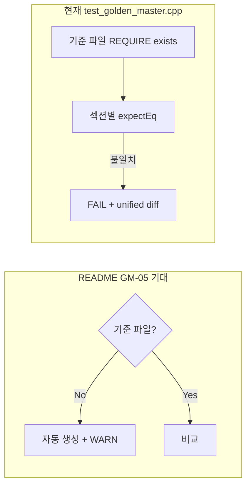

# Golden Master README 체크리스트·진행 보고서

## 문서 관리

| 항목 | 내용 |
|------|------|
| **보고서 ID** | RPT-GM-003 |
| **문서 유형** | REFACTORING — README Golden Master 회귀 안전장치 섹션·GM-01~09 추적 보고서 |
| **버전** | 1.0 |
| **작성일** | 2026-05-21 |
| **작성** | Golden Master 회귀 안전장치 문서화·체크리스트 대조 |
| **프로젝트** | UnitConverter (C++17, CMake, Catch2 v3.5.4) |
| **정본 참조** | [../README.md](../README.md) §Golden Master 회귀 안전장치, [../docs/PRD.md](../docs/PRD.md) §6.1·AC-02, [../docs/TODO.md](../docs/TODO.md) R-01 |
| **선행 보고서** | [06_REFACTORING_Golden_Master_Regression_Report.md](06_REFACTORING_Golden_Master_Regression_Report.md) (RPT-GM-001), [07_REFECTORING_Golden_Master_Test_Code_Report.md](07_REFECTORING_Golden_Master_Test_Code_Report.md) (RPT-GM-002) |
| **관련 산출물** | `tests/test_golden_master.cpp`, `tests/golden_master_expected.txt`, `scripts/generate_golden_master.ps1`, `scripts/generate_golden_master.sh` |

---

## 요약 (Executive Summary)

[README.md](../README.md) **RED 단계 To-Do 리스트** 바로 아래에 **「Golden Master 회귀 안전장치」** 섹션(GM-01~GM-09)을 추가하였다. 본 보고서는 README 체크리스트와 저장소 실제 상태를 대조하고, REFACTORING 전·후에 완료해야 할 항목을 추적한다.

| 구분 | 내용 |
|------|------|
| **문서화** | README 목차·본문에 GM-01~09 체크리스트 반영 (2026-05-21) |
| **구현 완료 (코드)** | GM-01~02, GM-04, GM-06 — 기준 파일·4 시나리오 테스트·CTest `GoldenMaster` |
| **부분·미완** | GM-03 (Git 스테이징), GM-05 (approve 자동 생성), GM-07~08 (CI), GM-09 (리팩터 후 재검증) |
| **로컬 실행** | `ctest -R GoldenMaster` **PASS** (~3.7s), 전체 CTest **50/50 PASS** |
| **Catch2** | GREEN **49건** (단위 45 + Golden Master 4) |

> **제안 커밋 메시지**: `docs(readme): add Golden Master regression checklist (GM-01~09)`

---

## 1. 배경·목적

### 1.1 배경

| 항목 | 설명 |
|------|------|
| **RPT-GM-001/002** | Golden Master 설계·`test_golden_master.cpp` 구현·실행 결과 문서화 완료 |
| **README 공백** | 회귀 안전장치가 Report에만 있고, 학습자용 README 체크리스트에는 없었음 |
| **REFACTORING 타이밍** | PRD R-01: 리팩터 PR은 기존 회귀 세트 **diff 0 (전부 GREEN)** 전제 |

### 1.2 목적

| 목적 | README GM 항목 대응 |
|------|---------------------|
| **학습자 가이드** | Refactoring 전·후에 무엇을 해야 하는지 한 화면에서 확인 |
| **진행 추적** | GM-01~09를 RED To-Do와 동일한 체크박스 형식으로 관리 |
| **Report 연계** | 06·07번 보고서 산출물과 README 문구 정합성 유지 |

---

## 2. README 추가 내용

### 2.1 삽입 위치

```text
## RED 단계 To-Do 리스트
  … (Track A/B, 커버리지, 결함 목록)
---
## Golden Master 회귀 안전장치    ← 신규
  … (GM-01~09)
---
## 빠른 시작 (Quick Start)
```

### 2.2 목차 갱신

| 항목 | 앵커 |
|------|------|
| 신규 링크 | `[Golden Master 회귀 안전장치](#golden-master-회귀-안전장치)` |
| 위치 | `RED 단계 To-Do 리스트` ↔ `빠른 시작` 사이 |

### 2.3 인용 블록·구조

README 본문은 아래 3개 하위 그룹으로 구성된다.

| 그룹 | 항목 ID | README 상태 (문서) |
|------|---------|-------------------|
| 기준 파일 생성 | GM-01 ~ GM-03 | `- [ ]` 미체크 |
| 테스트 코드 | GM-04 ~ GM-06 | `- [ ]` 미체크 |
| CI 연동 | GM-07 ~ GM-09 | `- [ ]` 미체크 |

> README 체크박스는 **의도적으로 미체크**로 두었다. 구현·Git·CI 완료 시 본 보고서 §4 기준으로 `[x]` 갱신을 권장한다.

---

## 3. GM-01~09 ↔ 구현·산출물 매핑

### 3.1 전체 대조표

| ID | README 요구 | 실제 상태 | 근거·비고 |
|----|-------------|-----------|-----------|
| **GM-01** | `golden_master_expected.txt` 생성 (`meter:2.5`) | **완료** | `tests/golden_master_expected.txt` L1~5 `[meter:2.5]` 섹션 |
| **GM-02** | `feet:1.0` / `yard:1.0` / `meter:0.0` 시나리오 추가 | **완료** | 동 파일 L6~17, GM-TC-02~04 |
| **GM-03** | `git add tests/golden_master_expected.txt` | **미완** | 저장소에 파일 존재; Git 추적·커밋은 작업자 확인 필요 |
| **GM-04** | `test_golden_master.cpp` + 기준 파일 작성 | **완료** | `tests/test_golden_master.cpp` (240줄), 4× `TEST_CASE_METHOD` |
| **GM-05** | approve 패턴 (없으면 생성, 있으면 비교) | **부분** | **섹션 비교만** 구현; 기준 없으면 `REQUIRE` 실패 (06번 설계의 auto-create·WARN **미구현**) |
| **GM-06** | CMake `add_test(GoldenMaster)` → PASS | **완료** | `CMakeLists.txt` L74~79; README 표기 `UnitConverter_test` → 실제 타깃 `unit_converter_tests` |
| **GM-07** | `.github/workflows/golden_master.yml` | **미완** | 프로젝트 루트 `.github/workflows/` 없음 |
| **GM-08** | PR 머지 차단 (required status check) | **미완** | GM-07 선행 |
| **GM-09** | Refactoring 후 Golden Master 재실행 PASS | **대기** | 현재 GREEN 빌드 기준 PASS; **리팩터 diff 적용 후** 재실행·기록 예정 |

### 3.2 GM-05: approve 패턴 vs 현재 구현



| 방식 | 기준 없음 | 기준 있음·일치 | 기준 있음·불일치 |
|------|-----------|----------------|------------------|
| **06번 설계 (approve)** | 생성 후 WARN·PASS | PASS | FAIL + diff |
| **07번 구현 (섹션 GM)** | **FAIL** (`REQUIRE` empty) | PASS | FAIL + diff |
| **권장 운영** | `scripts/generate_golden_master.ps1` 수동 실행 후 `git add` | `ctest -R GoldenMaster` | diff 리뷰 후 기준 갱신 |

GM-05를 README 문구와 완전히 맞추려면 (1) 테스트에 auto-create 분기 추가, 또는 (2) README를 「스크립트로 기준 생성 + 테스트는 비교만」으로 정리하는 **문서 정합** 중 택 1이 필요하다.

### 3.3 GM-06: README vs CMake 명칭

| README | 실제 |
|--------|------|
| `add_test(NAME GoldenMaster COMMAND UnitConverter_test)` | `add_test(NAME GoldenMaster COMMAND unit_converter_tests "[golden][regression][r01]")` |

동작은 동일하다. README GM-06 문구는 학습자 혼동 방지를 위해 `unit_converter_tests`로 정정하는 것을 권장한다.

---

## 4. GM-TC ↔ GM-ID 추적성

| GM-ID | GM-TC / 테스트명 | 입력 | 기준 섹션 |
|-------|------------------|------|-----------|
| GM-01 | GM-TC-01 | `meter:2.5` | `[meter:2.5]` |
| GM-02 (일부) | GM-TC-02 | `feet:1.0` | `[feet:1.0]` |
| GM-02 (일부) | GM-TC-03 | `yard:1.0` | `[yard:1.0]` |
| GM-02 (일부) | GM-TC-04 | `meter:0.0` | `[meter:0.0]` (stdout 0줄) |
| GM-04 | 전 GM-TC | — | `test_golden_master.cpp` |
| GM-06 | CTest `GoldenMaster` | 태그 `[golden][regression][r01]` | 4건 일괄 |

---

## 5. 실행 결과 (2026-05-21)

### 5.1 GoldenMaster CTest

```powershell
cd c:\DEV\UnitConverter_08
cmake -S . -B build -DUNIT_CONVERTER_RED_PHASE=OFF
cmake --build build
ctest --test-dir build -R GoldenMaster --output-on-failure
```

| 지표 | 결과 |
|------|------|
| CTest 이름 | `GoldenMaster` (#50) |
| 결과 | **PASS** |
| 시간 | 약 3.7초 |
| 포함 | GM-TC-01 ~ GM-TC-04 |

### 5.2 GREEN 전체 CTest

| 구분 | 건수 | 결과 |
|------|------|------|
| Catch2 discover (단위·통합) | 49 | PASS |
| CTest `GoldenMaster` (집계) | 1 | PASS |
| **CTest 총계** | **50** | **PASS** |
| 실패 로그 | `build/Testing/Temporary/LastTestsFailed.log` | (이전 실패 이력 가능 — 최신 실행 0 failed) |

### 5.3 RED 빌드 동작

| `UNIT_CONVERTER_RED_PHASE` | Golden Master |
|----------------------------|---------------|
| `ON` (기본) | `test_golden_master.cpp` **미컴파일**, CTest `GoldenMaster` **미등록** |
| `OFF` (GREEN) | 컴파일·등록·실행 |

---

## 6. README 체크리스트 권장 갱신안

구현·검증이 끝난 항목은 README에서 아래처럼 체크할 수 있다.

### 기준 파일 생성
- [x] GM-01: golden_master_expected.txt 생성 (meter:2.5 기준 출력)
- [x] GM-02: feet:1.0 / yard:1.0 / meter:0.0 시나리오 추가
- [ ] GM-03: git add tests/golden_master_expected.txt (버전 관리 포함)

### 테스트 코드
- [x] GM-04: test_golden_master.cpp + golden_master_expected.txt 작성
- [ ] GM-05: approve 패턴 적용 (파일 없으면 생성, 있으면 비교) — **스크립트 생성 + 섹션 비교로 대체**
- [x] GM-06: CMake: add_test(NAME GoldenMaster …) → PASS 확인

### CI 연동
- [ ] GM-07: .github/workflows/golden_master.yml 작성
- [ ] GM-08: PR 머지 차단 (required status check) 설정
- [ ] GM-09: Refactoring 후 Golden Master 재실행 → PASS 확인

---

## 7. 미완 항목·다음 작업

| 우선순위 | 항목 | 작업 |
|----------|------|------|
| P0 | GM-03 | `git add tests/golden_master_expected.txt` 후 커밋 |
| P1 | GM-07 | `golden_master.yml`: `cmake -DUNIT_CONVERTER_RED_PHASE=OFF`, `ctest -R GoldenMaster` |
| P1 | GM-08 | GitHub Branch protection → `GoldenMaster` required check |
| P2 | GM-05 | approve auto-create 구현 **또는** README/06번 문서를 「스크립트 approve」로 통일 |
| P2 | GM-09 | REFACTORING PR마다 `ctest -R GoldenMaster` + RPT-GM-003 §5 갱신 |
| P3 | README GM-06 | `UnitConverter_test` → `unit_converter_tests` 문구 정정 |

### 7.1 CI 워크플로 초안 (GM-07)

```yaml
name: Golden Master
on: [pull_request, push]
jobs:
  golden-master:
    runs-on: windows-latest
    steps:
      - uses: actions/checkout@v4
      - name: Configure
        run: cmake -S . -B build -DUNIT_CONVERTER_RED_PHASE=OFF
      - name: Build
        run: cmake --build build
      - name: Golden Master regression
        run: ctest --test-dir build -R GoldenMaster --output-on-failure
```

---

## 8. Report·문서 추적성

| 문서 | ID | 초점 |
|------|-----|------|
| [06_REFACTORING_Golden_Master_Regression_Report.md](06_REFACTORING_Golden_Master_Regression_Report.md) | RPT-GM-001 | approve 상태 전이·설계·제한 |
| [07_REFECTORING_Golden_Master_Test_Code_Report.md](07_REFECTORING_Golden_Master_Test_Code_Report.md) | RPT-GM-002 | P/C/T/F 구현·실행·운영 |
| **본 문서** | RPT-GM-003 | README GM-01~09 체크리스트·진행·갭 분석 |
| [README.md](../README.md) | — | 학습자용 GM 체크리스트 (미체크 상태) |

---

## 9. 결론

- README에 **Golden Master 회귀 안전장치** 섹션을 추가하여, REFACTORING 전 구축·GREEN 후 적용 흐름을 학습자 문서에 고정하였다.
- **GM-01, GM-02, GM-04, GM-06**은 코드·기준 파일·CTest 수준에서 **이미 충족**한다. 로컬 `ctest -R GoldenMaster` 및 **50/50 CTest PASS**로 검증하였다.
- **GM-03, GM-05(approve), GM-07~08(CI), GM-09(리팩터 후)** 은 미완 또는 부분 완료이며, 본 보고서 §6·§7을 기준으로 README 체크박스와 Report를 단계적으로 갱신하면 된다.

---

## 부록 A — README Golden Master 섹션 전문

```markdown
## Golden Master 회귀 안전장치

> Refactoring 시작 전 구축. GREEN 완료 후 즉시 적용.

### 기준 파일 생성
- [ ] GM-01: golden_master_expected.txt 생성 (meter:2.5 기준 출력)
- [ ] GM-02: feet:1.0 / yard:1.0 / meter:0.0 시나리오 추가
- [ ] GM-03: git add tests/golden_master_expected.txt (버전 관리 포함)

### 테스트 코드
- [ ] GM-04: test_golden_master.cpp + golden_master_expected.txt 작성
- [ ] GM-05: approve 패턴 적용 (파일 없으면 생성, 있으면 비교)
- [ ] GM-06: CMake: add_test(NAME GoldenMaster COMMAND UnitConverter_test) → PASS 확인

### CI 연동
- [ ] GM-07: .github/workflows/golden_master.yml 작성
- [ ] GM-08: PR 머지 차단 (required status check) 설정
- [ ] GM-09: Refactoring 후 Golden Master 재실행 → PASS 확인
```

## 부록 B — `golden_master_expected.txt` 요약

| 섹션 | 변환 줄 수 | PRD 참고 |
|------|------------|----------|
| `[meter:2.5]` | 3 | AC-02 `8.2021` / `2.7340` |
| `[feet:1.0]` | 3 | meter 허브 역·교차 환산 |
| `[yard:1.0]` | 3 | 동일 |
| `[meter:0.0]` | 0 | BV-01 stdout 0줄 |

전문: [../tests/golden_master_expected.txt](../tests/golden_master_expected.txt) · 상세: RPT-GM-002 부록 A.
